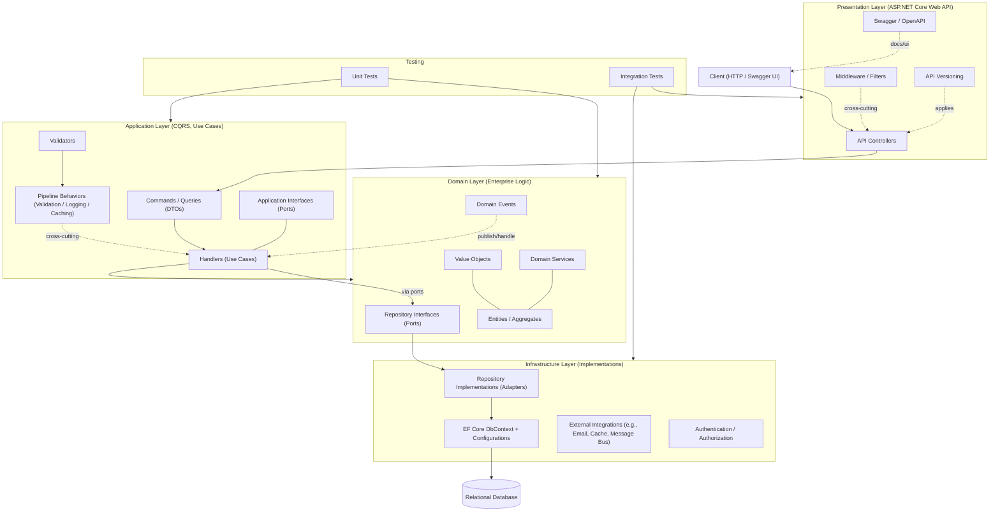

# Clean Architecture (ASP.NET Core + CQRS + EF Core)

This diagram illustrates the high-level architecture for the repository CleanArchitecture-Template. It follows Clean Architecture with CQRS and EF Core, organized into Presentation, Application, Domain, and Infrastructure layers, plus Testing and cross-cutting concerns.

## Key Notes
- Presentation exposes REST endpoints, handles concerns like API versioning, middleware, and OpenAPI/Swagger.
- Application implements use cases via CQRS (Commands/Queries + Handlers), with pipeline behaviors for validation, logging, and caching.
- Domain is independent and contains core business logic: Entities, Value Objects, Domain Events, and repository interfaces (ports).
- Infrastructure provides implementations (adapters) for the domain/application ports, including EF Core repositories, DbContext, and external integrations.
- Data flow: Controller -> Command/Query -> Handler -> Domain -> Repository -> DbContext -> Database, with responses traveling back up the stack.
- Testing includes fast unit tests for domain/application and integration tests against the API and infrastructure boundaries.
