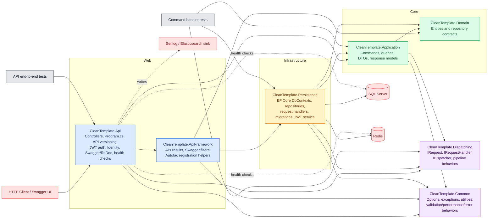
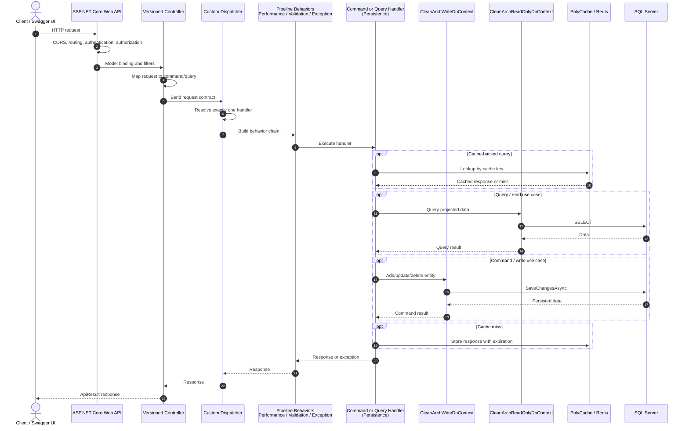

# CleanArchitecture-Template Architecture

This document describes the current architecture of CleanArchitecture-Template as implemented in this repository. The solution follows Clean Architecture principles with ASP.NET Core, CQRS-style request contracts, a custom dispatcher pipeline, EF Core, ASP.NET Core Identity, JWT authentication, Redis-backed caching, and GitHub-rendered Mermaid diagrams.

## Overview

The application is organized around clear dependency direction:

- **Web API** exposes versioned REST endpoints, Swagger/ReDoc documentation, JWT authentication, authorization, health checks, exception handling, validation filters, and application startup.
- **Application** defines command/query contracts, request DTOs, response models, and use-case abstractions. It does not own the handler implementations.
- **Domain** contains entities and repository contracts used by the application and persistence layers.
- **Persistence / Infrastructure** implements EF Core data access, read/write DbContexts, repositories, request handlers, Identity storage, JWT support, migrations, and cache-backed query behavior.
- **Dispatching** provides the custom in-process request dispatcher and pipeline behavior interfaces used instead of MediatR.
- **Common** contains reusable cross-cutting pieces such as exceptions, options, utilities, and request pipeline behaviors.

## Solution Structure

```text
src/
  Common/                  Shared options, exceptions, utilities, and dispatcher behaviors
  Core/
    Application/           Command/query contracts and response models
    Domain/                Entities and repository contracts
  Dispatching/             Custom IRequest/handler/dispatcher pipeline
  Infrastructure/
    Persistance/           EF Core, repositories, handlers, Identity/JWT, migrations, cache queries
  Web/
    Api/                   ASP.NET Core entrypoint, controllers, auth, Swagger/ReDoc, health checks
    ApiFramework/          API result wrappers, Swagger filters, Autofac registration helpers
test/
  CleanTemplate.CommandHandler.Tests/
  CleanTemplate.Api.EndToEndTests/
```

## Dependency Direction

The diagram below shows compile-time project dependencies and major runtime integrations. Inner layers remain independent of the Web API, while Persistence implements the data access and request-handler side of the application.


```mermaid
flowchart LR
  classDef web fill:#dbeafe,stroke:#2563eb,color:#172554
  classDef core fill:#dcfce7,stroke:#16a34a,color:#14532d
  classDef infra fill:#fef3c7,stroke:#d97706,color:#78350f
  classDef shared fill:#f3e8ff,stroke:#9333ea,color:#3b0764
  classDef external fill:#fee2e2,stroke:#dc2626,color:#7f1d1d
  classDef test fill:#e5e7eb,stroke:#4b5563,color:#111827

  Client["HTTP Client / Swagger UI"]:::external
  SqlServer[("SQL Server")]:::external
  Redis[("Redis")]:::external
  Logs["Serilog / Elasticsearch sink"]:::external

  subgraph Web["Web"]
    Api["CleanTemplate.Api<br/>Controllers, Program.cs, API versioning,<br/>JWT auth, Identity, Swagger/ReDoc, health checks"]:::web
    ApiFramework["CleanTemplate.ApiFramework<br/>API results, Swagger filters,<br/>Autofac registration helpers"]:::web
  end

  subgraph Core["Core"]
    Application["CleanTemplate.Application<br/>Commands, queries, DTOs, response models"]:::core
    Domain["CleanTemplate.Domain<br/>Entities and repository contracts"]:::core
  end

  subgraph Infrastructure["Infrastructure"]
    Persistence["CleanTemplate.Persistence<br/>EF Core DbContexts, repositories,<br/>request handlers, migrations, JWT service"]:::infra
  end

  Dispatching["CleanTemplate.Dispatching<br/>IRequest, IRequestHandler,<br/>IDispatcher, pipeline behaviors"]:::shared
  Common["CleanTemplate.Common<br/>Options, exceptions, utilities,<br/>validation/performance/error behaviors"]:::shared

  UnitTests["Command handler tests"]:::test
  EndToEndTests["API end-to-end tests"]:::test

  Client --> Api
  Api --> ApiFramework
  Api --> Application
  Api --> Dispatching
  Api --> Common
  ApiFramework --> Persistence
  ApiFramework --> Domain
  ApiFramework --> Common

  Application --> Domain
  Application --> Dispatching
  Application --> Common

  Persistence --> Application
  Persistence --> Domain
  Persistence --> Dispatching
  Persistence --> Common
  Persistence --> SqlServer
  Persistence --> Redis

  Api -.writes.-> Logs
  Api -.health checks.-> SqlServer
  Api -.health checks.-> Redis

  UnitTests --> Application
  UnitTests --> Persistence
  UnitTests --> Dispatching
  EndToEndTests --> Api
```

## Runtime Request Flow

Controllers translate HTTP requests into command/query contracts, then send them through the custom dispatcher. Pipeline behaviors wrap the handler execution, and the selected handler uses the appropriate read/write data path.


```mermaid
sequenceDiagram
  autonumber
  actor Client as Client / Swagger UI
  participant Api as ASP.NET Core Web API
  participant Controller as Versioned Controller
  participant Dispatcher as Custom Dispatcher
  participant Behaviors as Pipeline Behaviors<br/>Performance / Validation / Exception
  participant Handler as Command or Query Handler<br/>(Persistence)
  participant WriteDb as CleanArchWriteDbContext
  participant ReadDb as CleanArchReadOnlyDbContext
  participant Cache as PolyCache / Redis
  participant Sql as SQL Server

  Client->>Api: HTTP request
  Api->>Api: CORS, routing, authentication, authorization
  Api->>Controller: Model binding and filters
  Controller->>Controller: Map request to command/query
  Controller->>Dispatcher: Send request contract
  Dispatcher->>Dispatcher: Resolve exactly one handler
  Dispatcher->>Behaviors: Build behavior chain
  Behaviors->>Handler: Execute handler

  opt Cache-backed query
    Handler->>Cache: Lookup by cache key
    Cache-->>Handler: Cached response or miss
  end
  opt Query / read use case
    Handler->>ReadDb: Query projected data
    ReadDb->>Sql: SELECT
    Sql-->>ReadDb: Data
    ReadDb-->>Handler: Query result
  end
  opt Command / write use case
    Handler->>WriteDb: Add/update/delete entity
    WriteDb->>Sql: SaveChangesAsync
    Sql-->>WriteDb: Persisted data
    WriteDb-->>Handler: Command result
  end
  opt Cache miss
    Handler->>Cache: Store response with expiration
  end

  Handler-->>Behaviors: Response or exception
  Behaviors-->>Dispatcher: Response
  Dispatcher-->>Controller: Response
  Controller-->>Client: ApiResult response
```

## Cross-Cutting Concerns

- **Dependency injection** uses the built-in service collection plus Autofac assembly scanning for scoped, transient, and singleton dependencies.
- **Request pipeline** uses `PerformanceBehaviour`, `ValidationBehavior`, and `UnhandledExceptionBehaviour` around dispatcher handlers.
- **Validation** uses FluentValidation for API request models and dispatcher-level validation behavior.
- **Authentication and authorization** use JWT Bearer tokens and ASP.NET Core Identity backed by EF Core.
- **Documentation** is exposed through Swagger UI and ReDoc with API versioning support.
- **Data access** uses EF Core with separate read and write DbContext registrations plus generic repository contracts.
- **Caching** uses PolyCache and Redis for cache-backed query examples.
- **Observability** includes Serilog configuration and health checks for SQL Server and Redis.
- **Startup migration** applies EF Core migrations during application startup through `MigrationService`.

## Testing Strategy

- **Command handler tests** validate dispatcher behavior, pipeline execution, and individual command/query handler behavior.
- **End-to-end API tests** exercise HTTP endpoints through the Web API surface.
- Keep tests aligned with the actual boundaries above: Application contracts, Persistence handlers, Dispatching behavior, and Web API endpoints.
